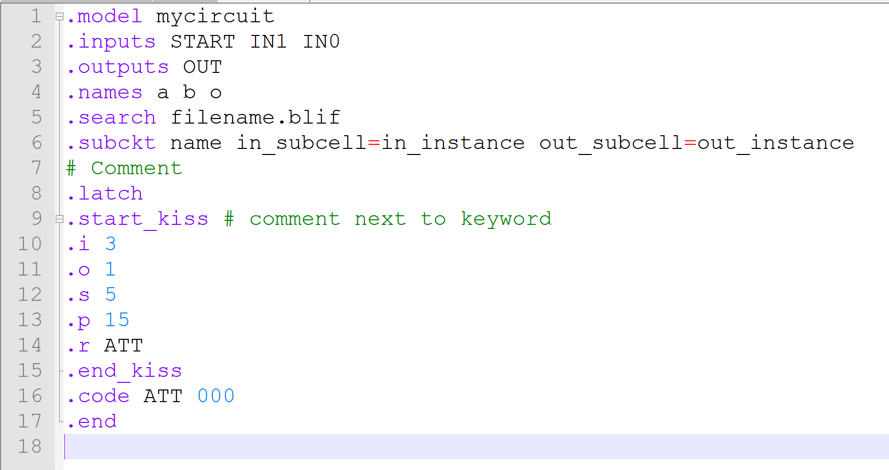

# NOTEPADPP-BLIF_SIS

This repository contains macros (templates) and a custom language file (syntax highlight) for Notepad++ to develop BLIF files.

> BLIF is SIS' Berkeley Logic Interchange Format.
>
> SIS is a tool that optimizes and simulates logic gate and finite state machine networks

The repository contains:
* ```userDefineLangs\blif.xml```: language file that provides syntax highlighing
* ```macros\fsm_template.xml```: macro that writes a template file for a finite state machine
* ```macros\lgate_template.xml```: macro that writes a template file for a combinational/logic gate circuit

> Disclaimer:
>
> I'm not affiliated with the SIS nor the Notepad++ developers in any way.
>
> The aim of these macros and custom language file is to add syntax highlighting for the BLIF format, SIS' Berkeley Logic Interchange Format, to Notepad++.

## Index

* [Installation](#installation)
    * [Language file](#language-file)
    * [Macros](#macros)
* [Requirements](#requirements-)
* [Changelog](#changelog-)
* [Author](#author-)

## Installation

### Language file

The language file "```userDefineLangs\blif.xml```" provides
syntax highlighting.

<center>



</center>

To "install" this custom language file put the
file inside this folder:

    %appdata%\Notepad++\userDefineLangs

You might need to close and then re-open Notepad++.

Open a .blif file and Notepad++ should be able to do syntax highlight.

[Go to the index](#index)

### Macros

This repository contains two macros:
* "```macros\fsm_template.xml```": macro that writes a template file for a finite state machine
    <center>

    

    </center>

* "```macros\lgate_template.xml```": macro that writes a template file for a combinational/logic gate circuit

    <center>

    

    </center>

First, check by creating and saving a macro on Notepad++ which hotkeys
are currently free: Notepad++ tells you if a combination is already in use.

Open the "```%appdata%\Notepad++\shortcuts.xml```" file and look for your macro.

You should see something like:

    <Macro name="test_template" Ctrl="yes" Alt="yes" Shift="yes" Key="96">

Remember the combination of Ctrl, Alt, Shift and Key values.
Delete this element.

Repeat this operation to find a second free hotkey combination.

To "install" the macros you need to open the "```shortcuts.xml```" file.

Then copy and paste the ```<Macro></Macro>``` element from the files in the "```macros```" folder inside the ```<Macros></Macros>``` element.

Be sure to change this line:

    <Macro name="fsm_template" Ctrl="yes" Alt="yes" Shift="yes" Key="97">

and:

    <Macro name="lgate_template" Ctrl="yes" Alt="yes" Shift="yes" Key="97">

This line specifies if you need to press the ctrl, alt and/or shift key and which key is part of the hotkey
to execute the macro.

You should know which values to set based on the values you remeber from earlier.

Close and re-open Notepad++.

Try on a new file to execute the macro: it should work.

> These macros where created by using the [file2npp_macro](https://github.com/mario33881/file2npp_macro) script.

[Go to the index](#index)

## Requirements 
* Notepad++

[Go to the index](#index)

## Changelog 

### 2020-03-27 01_01
First version

[Go to the index](#index)

## Author 
[Stefano Zenaro (mario33881)](https://github.com/mario33881)